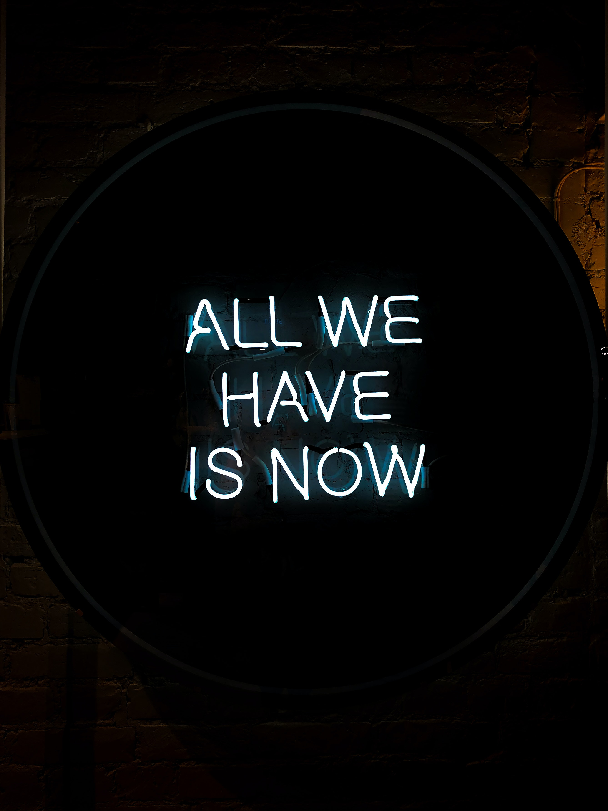

# abdulafeez3.github.io
<!DOCTYPE html>
<html>
    <head>
        <meta charset="UTF-8"/>
        <meta name= "Author" content="Mobile_comm.">
        <meta name= "keyword" content="Alt School HTML Project">
        <meta name= "viewport" content="width=device-width, initial scale=1.0">
        <title>My project</title>
    </head>
    <body style="background-color: rgb(255, 68, 0);">
        <section>
            <nav style="background-color: rgb(0, 0, 0);">
                
                    

                        <ul style="text-align: right; color: rgb(255, 255, 255); font-size: 20px;">
                           <li>HOME</li>
                           <li>MOTIVATION</li>
                           <li>ABOUT</li>
                           <li>CONTACT</li>
                        </ul>
                    

            </nav>
        </section>
        <marquee behavior="scroll" direction="down" scroll-amount=1m">
WELCOME TO THE HOME OF MOTIVATIONS
</marquee>
        <h2>Ready? Enter your details to catch your motivation</h2>
        <form action="" method="post">
            

                <label for="first_name">First Name</label>
                <input type="text" id="firt_name" class="first_name" name="first_name" required>
            

            

                <label for="last_name">Last Name</label>
                <input type="text" id="last_name" class="last_name" name="last_name" required>
            

            

                <label for="email">Email Address </label>
                <input type="email" id="email" class="email" name="email" required>
            

            

                <label for="first_name">First Name</label>
                <input type="text" id="firt_name" class="first_name" name="first_name">
            

            

                <label for="phone">Phone Number</label>
                <input type="number" id="phone" class="phone" name="phone" required>
            

            

                <label for="gender">Gender</label>
                <select type="Gender" id="gender" class="gender" name="gender" required>
                    <option value="male">Male</option>
                    <option value="female">Female</option>
                    <option value="prefer_not_to_say">Prefer not to say</option>
                </select>
            

            <button style="text-decoration-color: blue;">SHOW MY MOTIVATION</button>
        </form>
        

            <h3 style="text-decoration-color:blue ;">TODAY'S MOTIVATION</h3>
             
            
        

        

            <h2>LIST OF OUR VIEWERS</h2>
            <Table style="background-color: white;" border="2">
                <thead>
                    <tr>
                        <th>NAME</th>
                        <th>EMAIL</th>
                        <th>RANK</th>
                    </tr>  
                </thead>
                <tbody>
                    <tr>
                        <td>Tabitha Kavyu</td>
                        <td>tabithakavyu@gmail.com</td>
                        <td>Bring dollars to show</td>
                    </tr>
                    <tr>
                        <td>Tech Girl</td>
                        <td>techgirl@gmail.com</td>
                        <td>Gold (My Track-mate)</td>
                    </tr>
                    <tr>
                        <td>Abdulafeez</td>
                        <td>ayinlaabdulafeez3@gmail.com</td>
                        <td>Diamond</td>
                    </tr>
                </tbody>
            </Table>
        

        <h3 style= "color: rgb(255, 255, 255); text-align:center;"> Copyright © 2022, For: Alt_School HTML Mini Project</h3>
    </body>
</html>
